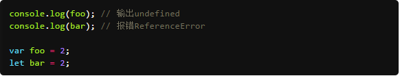
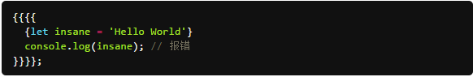

# ECMAScript6特性介绍

## **新增命令：****let 命令**

作用：用来声明变量。它的用法类似于var，但是所声明的变量，只在let命令所在的代码块内有效。代码块包括所有带大括号的区域，例如if和for以及函数作用域，原5的标准只有全局和函数作用域，let的引入增加了块作用域的概念.
示例：

**不存在变量提升**
let不像var那样会发生“变量提升”现象。所以，**变量一定要在声明后使用，否则报错**。

多层包裹时，内层作用域可以使用和重新声明外层的let声明的变量，反之不可以

有关变量提示的说明，请看http://www.jb51.net/article/30719.htm