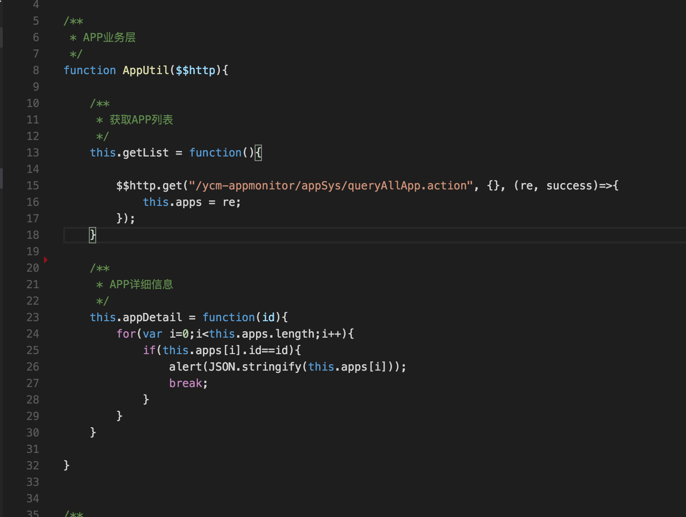

# 模块开发流程
##1.新建模块
1. 在modules目录下新建模块目录
2. 在模块目录下新建模块文件，exam.html、exam.js，如有样式表需要，可以再新建exam.scss
###1.1文件说明
.1. html文件为页面内容区域的渲染文件
2. js文件为模块文件，包含控制器注册，业务层处理，如有需要，可以拆分为多个JS文件

##2.配置模块
配置模块的步骤
1. 路由配置
2. 模块化加载配置
###2.1路由配置
参照modules/common/js/app.js
```
/**
 * 路由器配置
 * 
 * {
 * 		state		: <string>,			//路由器状态名
 * 		url			: <string>,			//访问url,为 依赖状态的url + 自身url
 * 		views		: <json>,			//路由页面的html模板配置
 * 		useModule	: <string>			//使用的RequireJS模块，初始化页面时会加载该模块的依赖文件
 * }
 */
var routerConfig = [
	{
		state	: "index",
		url		: "/",
		views	: {
			'' : {templateUrl : 'modules/common/html/layout.html'},
			'sidebar@index' : {templateUrl : 'modules/common/html/sidebar.html'},
			'top@index' : {templateUrl : 'modules/common/html/top.html'}
		},
		useModule	: 'com'
	},

	{
		state	: "index.app",
		url		: "app",
		views	: {
			'content@index' : {templateUrl : 'modules/app/app.html'}
		},
		useModule	: 'app'
	},

	{
		state	: "index.quota",
		url		: "quota",
		views	: {
			'content@index' : {templateUrl : 'modules/quota/quota.html'}
		},
		useModule	: 'quota'
	}
]
```
###2.2模块化加载配置
参照modules/common/js/app.js
```
/**
 * requireJS配置
 * 
 * paths : {
 * 		<moduleName>		: <string or Array>			//模块的JS文件配置，
 * }	
 * shim : {
 * 		<moduleName>		: <string or Array>			//模块的CSS文件配置，
 * }
 */
var requirejsConfig = {
	paths : {
		'com'			: 'modules/common/js/controller/controller',
		'util'			: 'modules/common/js/util',
		'directive'		: 'modules/common/js/directive/directive',
		'service'		: 'modules/common/js/service/service',
		'quota'			: 'modules/quota/quota',
		'app' 			: ['modules/app/app']
	},
	shim : {
		'app'			: ['css!modules/app/app.css']
	},
	map: {'*': {'css'	: 'components/require-css/css'}}
};
require.config(requirejsConfig);
```
##3.模块开发
###3.1控制器注册
参照modules/app/app.js
```
/**
 * appController 对应app.html的指令ng-controller="appController"
 * 
 * 这里引入了自定义服务$$host，引入于service模块（modules/common/js/service/main.js）
 */
App.register.controller("appController", function($scope, $$http){
    // AppUtil.call($scope, $$http);

	// $$host.getHost();
    // $scope.getList();
})
```

###3.2控制器业务层注册
参照modules/app/app.js

####3.2.1.定义业务层

####3.2.2注册业务层
```
/**
 * 使用Function的call方法注册
 */
App.register.controller("appController", function($scope, $$http){
    AppUtil.call($scope, $$http);
    $scope.getList();
})
```